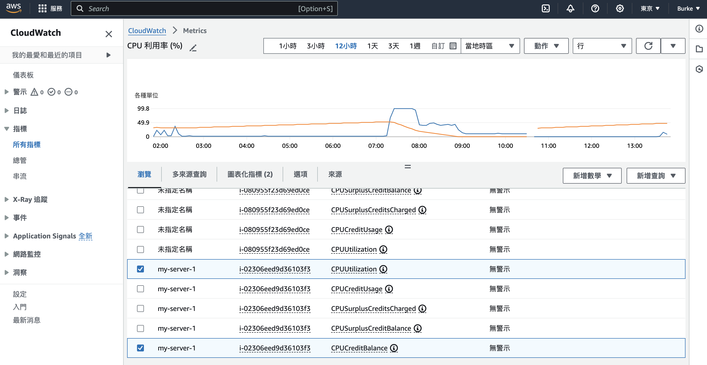

# TODO LIST

## Setup Instructions

### 1. Create .env file

Before getting started, create a `.env` file in the root directory of the project and add your database configuration details:

```plaintext
DB_NAME=your_database_name
DB_USER=your_database_user
DB_PASSWORD=your_database_password
DB_HOST=your_database_host
DB_PORT=your_database_port
```

### 2. Install Dependencies

Ensure you have Poetry installed. If not, follow the instructions on [Poetry's official documentation](https://python-poetry.org/docs/#installation) for installation.

Once Poetry is installed, navigate to your project directory and run:

```bash
poetry install
poetry shell
```

### 3. Database Migration
```
python manage.py migrate
```

### 4.  Run the Development Server
```
python manage.py runserver
```


### Additional Notes

- **.env File**: Ensure the `.env` file contains correct database configuration details (`DB_NAME`, `DB_USER`, `DB_PASSWORD`, `DB_HOST`, `DB_PORT`).
- **Poetry Install**: Use `poetry install` to install all project dependencies specified in `pyproject.toml`.
- **Database Migration**: Use `python manage.py migrate` to apply database migrations and set up the database schema.
- **Runserver**: Use `python manage.py runserver` to start the Django development server locally.
- **Technologies Used**HTML, Tailwind CSS, Python, Django, MySQL

### Video
```
https://youtu.be/IDxoHU1-pzk
```

### Deployment

#### SSH Login
* my-server-1.pem: 創建 ec2 時可獲得的金鑰（記得勾選並下載）。記得配置安全組，允許SSH（端口22）訪問，另外如果有web應用，還需要允許HTTP（端口80）或HTTPS（端口443）訪問。
* ubuntu: 用戶名，根據 ec2 所選的作業系統不同而異。這裡選擇 ubuntu-22.04
* 35.77.98.48: ec2 的"公有 IPv4 地址"
* 建完 instance，可以將 public ip (還有網域)填到 core/settings.py 的 ALLOWED_HOSTS。 例如：ALLOWED_HOSTS = ['ulatodolist.ddns.net', '35.77.98.48', 'localhost', '127.0.0.1']。然後 commit
```
ssh -i "my-server-1.pem" ubuntu@35.77.98.48
```
* 若出現以下錯誤
```
Permissions 0644 for 'my-server-1.pem' are too open.
It is required that your private key files are NOT accessible by others.
This private key will be ignored.
Load key "my-server-1.pem": bad permissions
my-server-1@54.238.208.159: Permission denied (publickey).
```
* 用 `chmod 600 my-server-1.pem` 解決


#### Docker

* 進入終端後
```
sudo su -
snap install docker
git clone https://github.com/BurkeyLai/ula-todo-list.git
cd ula-todo-list
```

* 這裏 app 的 EXPOSE port 直接對應到 EC2 instance 的 http listen 的 `80`。若要讓 https listen 的 `443` 也能訪問，EXPOSE port 改成其他 port，然後要用 nginx 反向代理。
```
docker-compose -f docker-compose.yml build
docker-compose -f docker-compose.yml up -d
```

#### Nginx
* 有需要再設定
* 在 instance 的終端執行：
```
apt update
apt install nginx
systemctl start nginx
systemctl enable nginx
systemctl status nginx

vim /etc/nginx/nginx.conf
systemctl restart nginx
```
* `nginx.conf`:
```
http {
    ...
    server {
        listen 80;
        server_name ulatodolist.ddns.net;

        location / {
            proxy_pass http://localhost:8000;
            proxy_http_version 1.1;
            proxy_set_header Upgrade $http_upgrade;
            proxy_set_header Connection 'upgrade';
            proxy_set_header Host $host;
            proxy_cache_bypass $http_upgrade;
        }
    }
}
```

#### AWS Metrics

* 可透過 `CloudWatch > Metrics` 觀察 CPU 使用率
* 在 `瀏覽` tab 勾選要觀察的 instance 的指標